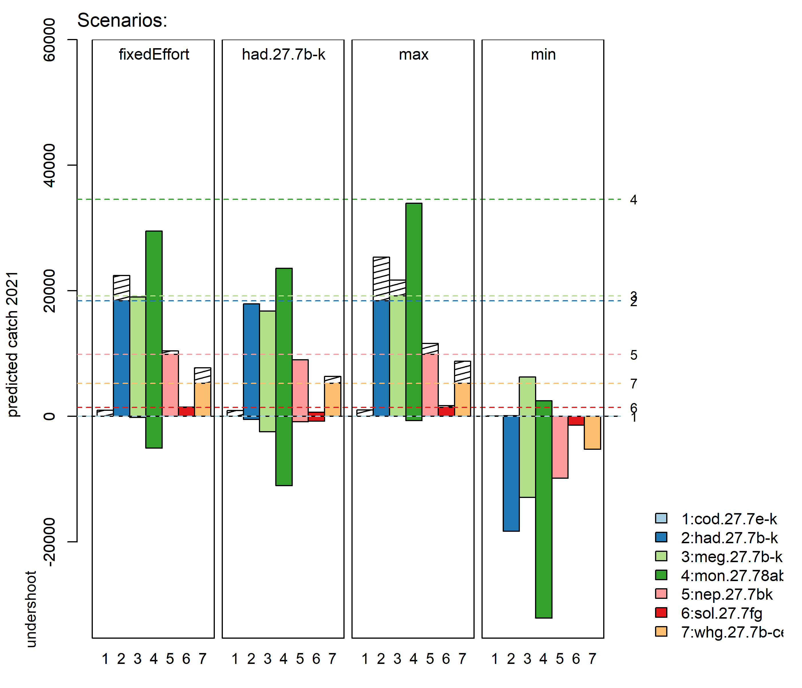
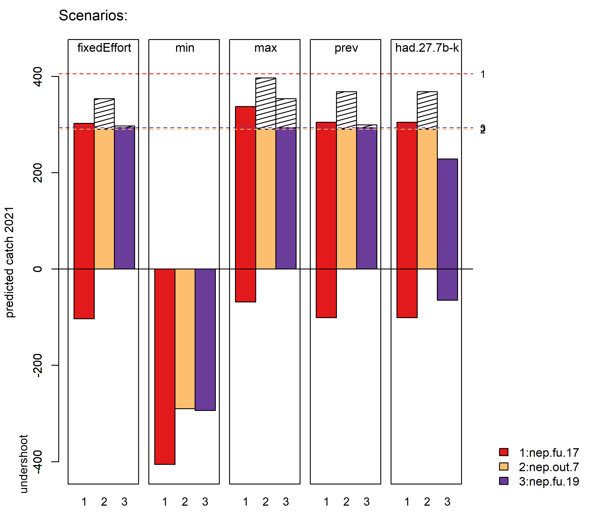
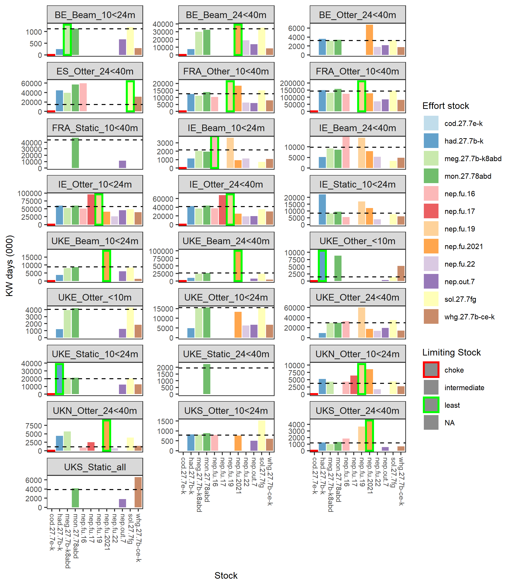

``` {r echo = FALSE, message = FALSE}

options(scipen=999)

## Load libraries
suppressWarnings(library(knitr))
suppressWarnings(library(tidyverse))
suppressWarnings(library(flextable))

## define current assessment year
ay <- 2020

## Check available plots
figureVector <- dir("figures")
tableVector  <- dir("tables")

## Define figure and table captions
figureCaptions <- c(paste0("Mixed-fisheries projections. Estimates of potential catches (in tonnes) by stock and by scenario. Horizontal lines correspond to the single-stock catch advice for ",ay+1,". Bars below the value of zero show undershoot (compared to single-stock advice) where catches are predicted to be lower when applying the scenario. Hatched columns represent catches that overshoot the single-stock advice."),
                  
                  paste0("Mixed fisheries projections results for the stocks subject to lower landings (detail from Figure ref(fig:figProj),). Estimates of potential catches (in tonnes) by stock and by scenario. Horizontal lines correspond to the single-stock catch advice for ",ay+1,". Bars below the value of zero show undershoot (compared to single-stock advice) where catches are predicted to be lower when applying the scenario. Hatched columns represent catches that over-shoot the single-stock advice."),
                  
                  "Mixed fisheries for the North Sea. Estimates of effort by fleet needed to reach each single-stock advice. Red triangles highlight the most limiting species for that fleet in 2019 (“choke species”), whereas the green triangles highlight the least limiting species. (1: cod.27.47d20, 2: had.27.46a20, 3_1: nep.fu.5, 3_2: nep.fu.6, 3_3: nep.fu.7, 3_4: nep.fu.8, 3_5: nep.fu.9, 3_6: nep.fu.10, 3_7: nep.fu.32, 3_8: nep.fu.33, 3_9: nep.fu.34, 3_10: nep.27.4outFU, 4: ple.27.7d, 5: ple.27.420, 6: pok.27.3a46, 7: sol.27.4, 8: tur.27.4, 9: whg.27.47d, 10: wit.27.3a47d). Fleet names are given by country (BE = Belgium, DK = Denmark, EN = England, FR = France, GE = Germany, IE = Ireland, NI = Northern Ire-land, NL = the Netherlands, SC = Scotland, SW = Sweden, OTH = Others) and by mean-ingful combinations of main gear and vessel size differing across countries and based on homogeneous average fishing patterns. FDF = Fully Documented Fisheries vessels. Vessels in the various fleet segments can engage in several fisheries (métiers) over the year.",
                  
                  paste0("Mixed fisheries for the North Sea. Estimates of effort by fleet needed to reach each single-stock advice. Stocks are coded by color, with most limiting stock (“choke species”) for each fleet in ",ay+1," highlighted with red border and least limiting species highlighted with a green border. Fleet names are given by country (BE = Belgium, DK = Denmark, EN = England, FR = France, GE = Germany, IE = Ireland, NI = Northern Ireland, NL = the Netherlands, SC = Scotland, SW = Sweden, OTH = Others) and by meaningful combinations of main gear and vessel size differing across countries and based on homogeneous average fishing patterns. Vessels in the various fleet segments can engage in several fisheries (métiers) over the year. Horizontal dashed line shows the projected fishing effort per fleet assuming status quo from the most recent data year."),
                  
                  paste0("Mixed fisheries for the North Sea. Estimated SSB at the start of ",ay+2," by stock after applying the mixed-fisheries scenarios, expressed as a ratio to the single-stock advice forecast. The horizontal line corresponds to the SSB resulting from the single-stock advice. Norway lobster are not included as the abundance was not forecasted in the mixed-fisheries model."),
                  
                  paste0("North Sea mixed-fisheries ",ay+1," “range” fishing mortality within the FMSY range, compared with FMSY, the current F (F in ",ay,"), and F in the single-stock advice for ",ay,". The “range” F is the one giving the lowest difference in tonnage between the “Max” and the “Min” scenario across all stocks and fleets. For cod in the North Sea, FMSY ranges are limited in accordance with the MSY approach and the MAP when below MSY Btrigger."),
                  
                  paste0("Comparison of the outcomes in terms of total catches in ",ay+1," (left) and SSB in ",ay+2," (right) between the FMSY-based single-stock advice and the Frange-based forecast."))


tableCaptions <- c("Nomenclature used in the document",
                 
                 paste0("[TEMPORARY TABLE WITHOUT RANGE] Mixed fisheries for the Celtic Sea. SSB results from single-stock advice and different mixed-fisheries scenarios (see Figure ???). Norway lobster are not included as the abundance is not forecasted in the mixed-fisheries model. All weights are in tonnes. Unless otherwise noted, SSB (",ay+2,") > Bpa or MSY Btrigger."),
                 
                 paste0("Mixed fisheries for the Celtic Sea. SSB results from single-stock advice and different mixed-fisheries scenarios (see Figure ???). Norway lobster are not included as the abundance is not forecasted in the mixed-fisheries model. All weights are in tonnes. Unless otherwise noted, SSB (",ay+2,") > Bpa or MSY Btrigger."),
                 
                 paste0("[TEMPORARY TABLE WITHOUT RANGE] Mixed fisheries for the Celtic Sea. Catch per mixed-fisheries scenario ",ay+1,", in absolute values."),
                 
                 paste0("Mixed fisheries for the North Sea. Catch per mixed-fisheries scenario ",ay+1,", in absolute values."),
                 
                 "[TEMPORARY TABLE WITHOUT RANGE] Mixed fisheries for the North Sea. Ftotal resulting from single-stock advice and different mixed-fisheries scenarios. Norway lobster are not included as management is not applied at functional unit level.",
                 
                 "Mixed fisheries for the North Sea. Ftotal resulting from single-stock advice and different mixed-fisheries scenarios. Norway lobster are not included as management is not applied at functional unit level.",
                 
                 "Mixed fisheries for the North Sea. FMSY ranges used for the “range” scenario.",
                 
                 paste0("Relative Catch in ",ay+1),
                 
                 "Single Stock Advice Table")

```

Definitions
===========

``` {r tabNom, echo = FALSE}

## tabulate
if("tabNom" %in% tableVector) {
  
  knitr::kable(tabNom, caption = tableCaptions[1])
  
}
```

\newpage

Figures
=======

``` {r figProj, fig.width=12, fig.cap= figureCaptions[1], echo = FALSE}

## plot
if("figProj.png" %in% figureVector){
  
  
  
}
```

``` {r figProjLow, fig.width=12, fig.cap= figureCaptions[2], echo = FALSE}

## plot
if("figProjLow.png" %in% figureVector){
  
  
  
}
```

``` {r figMixFishRose, fig.width=12, fig.cap= figureCaptions[3], echo = FALSE}

## plot
if("figMixFishRose.png" %in% figureVector){
  
  knitr::include_graphics("figures/figMixFishRose.png")
  
}
```

``` {r figMixFishBar, fig.width=12, fig.cap= figureCaptions[4], echo = FALSE}

## plot
if("figMixFishBar.png" %in% figureVector){
  
  
  
}
```

``` {r figMixFishSSB, fig.width=12, fig.cap= figureCaptions[5], echo = FALSE}

## plot
if("figMixFishSSB.png" %in% figureVector){
  
  
  
}
```

\newpage
Tables
======

``` {r tabMixFishSSB, echo = FALSE}

## tabulate
if("tabMixFishSSB.csv" %in% tableVector) {
  
  tabMixFishSSB <- read.csv("tables/tabMixFishSSB.csv")
  
  ## replace "." with "-" in columns
  names(tabMixFishSSB) <- gsub("\\.","-",names(tabMixFishSSB))
  
  knitr::kable(tabMixFishSSB %>%
                 column_to_rownames("stock"), 
               caption = tableCaptions[2],
               digits = 0, 
               align =  c("l",rep("r",ncol(tabMixFishSSB)-1)), 
               booktabs = TRUE)
  
}
```

\newpage
``` {r tabMixFishCatch, echo = FALSE}

## tabulate
if("tabMixFishCatch.csv" %in% tableVector) {
  
  tabMixFishCatch <- read.csv("tables/tabMixFishCatch.csv")
  
  ## replace "." with "-" in columns
  names(tabMixFishCatch) <- gsub("\\.","-",names(tabMixFishCatch))
  
  knitr::kable(tabMixFishCatch %>%
                 column_to_rownames("stock"), 
               caption = tableCaptions[4],
               digits = 0,
               align =  c("l",rep("r",ncol(tabMixFishCatch)-1)))
  
}
```

\newpage
``` {r tabMixFishFbar, echo = FALSE}

## tabulate
if("tabMixFishFbar.csv" %in% tableVector) {
  
  tabMixFishFbar <- read.csv("tables/tabMixFishFbar.csv")
  
  ## replace "." with "-" in columns
  names(tabMixFishFbar) <- gsub("\\.","-",names(tabMixFishFbar))
  
  knitr::kable(tabMixFishFbar %>%
               column_to_rownames("stock"), 
               caption = tableCaptions[6],
               digits = 3,
               align =  c("l",rep("r",ncol(tabMixFishFbar)-1)))
  
}
```

\newpage
``` {r tabMixFishFMSY, echo = FALSE}

## NOT YET IMPLEMENTED

# ## tabulate
# if("tabMixFishFMSY.csv" %in% tableVector) {
#   
#   tabMixFishFMSY <- read.csv("tables/tabMixFishFMSY.csv")
#   knitr::kable(tabMixFishFMSY, caption = tableCaptions[4])
#   
# }
```

\newpage
``` {r tabRelCatch, echo = FALSE}

## tabulate
if("tabRelCatch.csv" %in% tableVector) {
  
  tabRelCatch <- read.csv("tables/tabRelCatch.csv")
  
  ## Round values
  tabRelCatch[,!(names(tabRelCatch) %in% c("stock","single.stock.advice"))] <- round(tabRelCatch[,!(names(tabRelCatch) %in% c("stock","single.stock.advice"))],5)
  tabRelCatch[,names(tabRelCatch) == "single.stock.advice"] <- round(tabRelCatch[,names(tabRelCatch) == "single.stock.advice"],0)
  
  ## replace "." with "-" in columns
  names(tabRelCatch) <- gsub("\\.","-",names(tabRelCatch))
  
  ## print table
  knitr::kable(tabRelCatch %>%
                 column_to_rownames("stock"), 
               caption = tableCaptions[9],
               align =  c("l",rep("r",ncol(tabRelCatch)-1)))
  
}
```

\newpage
``` {r tabAdvice, echo = FALSE}

## tabulate
if("tabAdvice.csv" %in% tableVector) {
  
  tabAdvice <- read.csv("tables/tabAdvice.csv")
  knitr::kable(tabAdvice %>%
                 column_to_rownames("stock"), 
               caption = tableCaptions[6])
  
}
```

\newpage

Additional figures and tables for advice sheet
==============================================

``` {r echo = FALSE, message = FALSE, warning = FALSE}

## Some processing of data in anticipation of reporting and plotting
summary_fleet <- read.csv("1_Data/03_metier_stock_summary.csv") %>% filter(year == (ay-1))
summary_fleet <- summary_fleet %>% 
  select(fleet, metier, stock, landings, discards) %>%
  group_by(fleet, metier, stock) %>% 
  summarise(landings = unique(landings), discards = unique(discards))

summary_fleetLD <- summary_fleet %>% 
 mutate(fleetcat = "Oth",
         fleetcat = ifelse(substr(metier,1,3) %in% c("OTB", "SSC"), "OTB_SSC", fleetcat),
         fleetcat = ifelse(substr(metier,1,3) == "TBB", "TBB", fleetcat),
         fleetcat = ifelse(substr(metier,1,3) %in% c("GNS","GTR"), "GNS_GTR", fleetcat)) %>%
  group_by(fleetcat) %>%
  summarise(landings = sum(landings),
            discards = sum(discards))

landings_total   <- sum(summary_fleetLD$landings)
landings_OTB     <- summary_fleetLD$landings[summary_fleetLD$fleetcat == "OTB_SSC"]
landings_GNS_GTR <- summary_fleetLD$landings[summary_fleetLD$fleetcat == "GNS_GTR"]
landings_TBB     <- summary_fleetLD$landings[summary_fleetLD$fleetcat == "TBB"]
landings_Oth     <- summary_fleetLD$landings[summary_fleetLD$fleetcat == "Oth"]

discards_total <- sum(summary_fleetLD$discards)

summary_stockLD <- summary_fleet %>%
  group_by(stock) %>%
    summarise(landings = sum(landings),
            discards = sum(discards)) %>%
  mutate(percLandings = round(landings/sum(landings)*100)) %>%
  arrange(stock)

## Define additional figure and table captions for the advice sheet
tableCaptionsAdvice <- c(paste0("Mixed-fisheries advice in the Celtic Seas ecoregion. Catch per mixed-fisheries scenario ",ay+1,", in absolute values."),
                         
                         paste0("Mixed-fisheries advice for divisions 7.b–c and 7.e–k. TAC year (",ay+1,") fishing mortality or harvest ratio (for Norway lobster) forecast by scenario. The F range is averaged across the same ages as those used for the single-stock assessment. The colour gradients of the legend show the forecast fishing mortality under the scenario in relation to reference points detailed in the legend."),
                         
                         paste0("Mixed-fisheries advice for divisions 7.b–c and 7.e–k. Spawning-stock biomass (SSB) results in ",ay+2," from single-stock advice and different mixed-fisheries scenarios (see Figure ???). Weights in tonnes. The colour gradients of the legend show the forecast SSB under the scenario in relation to reference points detailed in the legend."))

figureCaptionsAdvice <- c(paste0("Mixed-fisheries advice for divisions 7.b–c and 7.e–k. Landings distribution of species by métier with landings consisting of ≥ 1% of any of the stocks (see Table ???) in ",ay-1," (list of métiers available in Table 4). Note: The “other” (OTH) displayed here is a mixed category consisting of (i) landings without corresponding effort and (ii) landings of any combination of fleet and métier with landings < 1% of any of the stocks (Table ???) in ",ay-1,"."),
                          
                          paste0("Mixed fisheries for the Celtic Sea. Landings distribution by species: ", paste(summary_stockLD$percLandings,summary_stockLD$stock, sep = "% ", collapse = ", "),"."))

```

``` {r tabFbarGradient, echo = FALSE, tab.cap = tableCaptionsAdvice[2]}

## tabulate
if("tabMixFishFbar.csv" %in% tableVector) {
  
  tabMixFishFbar <- read.csv("tables/tabMixFishFbar.csv")
  ssaRefPoints   <- read.csv("1_Data/BRPs_GA.csv") 
  
  # I want to conditionally format scenario cells based on their relation to biological reference points.
  # I would like this system to be flexible - accommodating different numbers and arrangements of species and scenarios.
  # The code below is certaintly not elegant... but hopefully get's the job done
  
  ## Get BRPs into same ordering as tabulated data
  tabRefPoints <- tabMixFishFbar %>%
      left_join(ssaRefPoints, by = "stock") %>%
      select(FMSY, Fpa, Flim)
  
  ## Extract names of scenarios present
  scenario_names <- names(tabMixFishFbar)[3:ncol(tabMixFishFbar)]

  ## Generate vector for each scenario present
  scenario_FMSY <- tabMixFishFbar[,scenario_names] > tabRefPoints$FMSY & 
                     tabMixFishFbar[,scenario_names] < tabRefPoints$Fpa
  scenario_Fpa  <- tabMixFishFbar[,scenario_names] > tabRefPoints$Fpa
  scenario_Flim <- tabMixFishFbar[,scenario_names] > tabRefPoints$Flim
  
  # This is not quite satisfactory... missing reference points are completely ignored below.
  # Need to have a better way of flagging this - possibly a nice bright colour
  
  ## Quick handling of NAs
  scenario_FMSY[is.na(scenario_FMSY)] <- FALSE
  scenario_Fpa[is.na(scenario_Fpa)] <- FALSE
  scenario_Flim[is.na(scenario_Flim)] <- FALSE
  
  ## quick formatting colour
  scenario_colour <- ifelse(scenario_FMSY, "gray80", 
                            ifelse(scenario_Fpa, "gray50", "white"))
  scenario_colour <- ifelse(scenario_Flim, "black", scenario_colour)

  scenario_text <- ifelse(scenario_Flim, "white", "black") 
  
  ## Round to 3 decimal places
  tabMixFishFbar[,scenario_names] <- round(tabMixFishFbar[,scenario_names],3)
  
  ## Generate table
  tabMixFishFbar %>%
    flextable() %>%
    flextable::add_header_row(values = c("", paste0("Fishing mortality per mixed-fisheries scenario (",ay+1,")")),
                              colwidths = c(2,length(scenario_names))) %>%
    flextable::bg(j = 3:ncol(tabMixFishFbar),
       bg = scenario_colour) %>%
    flextable::color(j = 3:ncol(tabMixFishFbar),
       color = scenario_text) %>%
    set_table_properties(width = 1, layout = "autofit") %>%
    theme_booktabs()
  
}
```
``` {r echo = FALSE}
if("tabMixFishFbar.csv" %in% tableVector) {
  ## Generate legend for table
  data.frame(Legend = c(paste0("F",ay+1," <= FMSY"),
                        paste0("F",ay+1," > FMSY, < Fpa"),
                        paste0("F",ay+1," < Fpa"),
                        paste0("F",ay+1," < Flim"))) %>%
    flextable() %>%
    bg(j = 1,
       bg = c("white","gray80","gray50","black")) %>%
    flextable::color(j = 1,
                     color = c("black","black","black","white")) %>%
    set_table_properties(width = .3, layout = "autofit")
}
```

\newpage

``` {r tabSSBGradient, echo = FALSE, tab.cap = tableCaptionsAdvice[3]}

## tabulate
if("tabMixFishSSB.csv" %in% tableVector) {
  
  tabMixFishSSB <- read.csv("tables/tabMixFishSSB.csv")
  ssaRefPoints   <- read.csv("1_Data/BRPs_GA.csv") 
  
  # I want to conditionally format scenario cells based on their relation to biological reference points.
  # I would like this system to be flexible - accommodating different numbers and arrangements of species and scenarios.
  # The code below is certaintly not elegant... but hopefully get's the job done
  
  ## Get BRPs into same ordering as tabulated data
  tabRefPoints <- tabMixFishSSB %>%
      left_join(ssaRefPoints, by = "stock") %>%
      select(MSYBtrigger, Bpa, Blim)
  
  ## Extract names of scenarios present
  scenario_names <- names(tabMixFishSSB)[3:ncol(tabMixFishSSB)]

  ## Generate vector for each scenario present
  scenario_BMSY <- (tabMixFishSSB[,scenario_names] > tabRefPoints$Bpa) | (tabMixFishSSB[,scenario_names] > tabRefPoints$MSYBtrigger)
  scenario_noBpa<- (tabMixFishSSB[,scenario_names] > tabRefPoints$Blim) & is.na(tabRefPoints$Bpa)
  scenario_Bpa  <- (tabMixFishSSB[,scenario_names] > tabRefPoints$Blim)
  scenario_Blim <- tabMixFishSSB[,scenario_names] < tabRefPoints$Blim
  
  # NOTE that cells with missing reference point values are being flagged as RED.
  
  ## Quick handling of NAs
  scenario_BMSY[is.na(scenario_BMSY)]   <- FALSE
  scenario_noBpa[is.na(scenario_noBpa)] <- FALSE
  scenario_Bpa[is.na(scenario_Bpa)]     <- FALSE
  scenario_Blim[is.na(scenario_Blim)]   <- FALSE
  
  ## quick formatting colour
  scenario_colour <- ifelse(scenario_BMSY, "white", 
                            ifelse(scenario_noBpa, "gray50", 
                                   ifelse(scenario_Bpa, "gray80", "red")))
  scenario_colour <- ifelse(scenario_Blim, "black", scenario_colour)

  scenario_text <- ifelse(scenario_Blim, "white", "black")
  
  ## Round to 3 decimal places
  tabMixFishSSB[,scenario_names] <- round(tabMixFishSSB[,scenario_names],0)
  
  ## Generate table
  tabMixFishSSB %>%
    flextable() %>%
    flextable::add_header_row(values = c("", paste0("SSB (",ay+2,") resulting from mixed-fisheries scenario applied in ",ay+1)),
                              colwidths = c(2,length(scenario_names))) %>%
    flextable::bg(j = 3:ncol(tabMixFishSSB),
       bg = scenario_colour) %>%
    flextable::color(j = 3:ncol(tabMixFishSSB),
       color = scenario_text) %>%
    set_table_properties(width = 1, layout = "autofit") %>%
    theme_booktabs()
  
}
```
``` {r echo = FALSE}
if("tabMixFishSSB.csv" %in% tableVector) {
  ## Generate legend for table
  data.frame(Legend = c(paste0("SSB",ay+2," > Bpa or MSY Btrigger"),
                        paste0("SSB",ay+2," > Blim, no Bpa defined"),
                        paste0("SSB",ay+2," > Blim"),
                        paste0("SSB",ay+2," < SSBlim"))) %>%
    flextable() %>%
    bg(j = 1,
       bg = c("white","gray80","gray50","black")) %>%
    flextable::color(j = 1,
                     color = c("black","black","black","white")) %>%
    set_table_properties(width = .3, layout = "autofit")
}
```

\newpage

``` {r figMetierLandings, fig.width=12, fig.cap= figureCaptionsAdvice[1], echo = FALSE}

## plot
if("figMetierLandings.png" %in% figureVector){
  
  
  
}
```

\newpage

Total landings (`r ay-1`) of all species considered in the mixed-fishery advice were `r round(landings_total)` tonnes, with:

 - `r round(landings_OTB/landings_total*100)` % landed by otter trawls and seines;
 - `r round(landings_TBB/landings_total*100)` % landed by beam trawls;
 - `r round(landings_GNS_GTR/landings_total*100)` % by gill- and trammel-nets; 
 - `r round(landings_Oth/landings_total*100)` % by other gears.

Total discards (not shown in the plot) were `r round(discards_total)` tonnes (`r round(discards_total/(landings_total + discards_total)*100)`% by weight of total catch).

``` {r figPieLandings, fig.width=12, fig.cap= figureCaptionsAdvice[2], echo = FALSE}

## plot
if("figPieLandings.png" %in% figureVector){
  
  
  
}
```